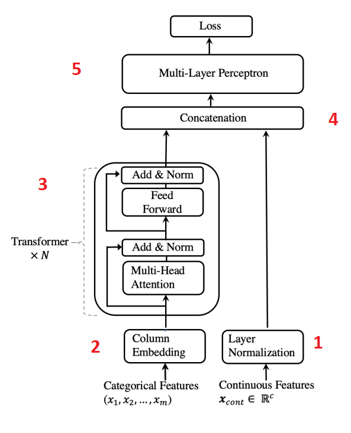
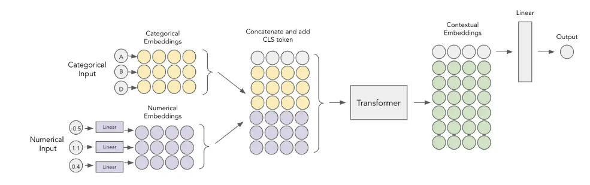
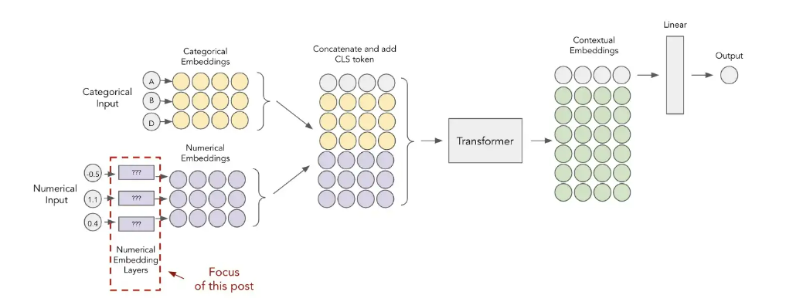

## 1. TabTransformer
Paper: [TabTransformer-2020](https://arxiv.org/pdf/2012.06678.pdf)

1. Numerical features are normalised and passed forward
2. Categorical features are embedded
3. Embeddings are passed through Transformer blocks N times to get contextual embeddings
4. Contextual categorical embeddings are concatenated with numerical features
5. Concatenation gets passed through MLP to get the required prediction

## 2. FT-Transformer
Paper:  [FT-Transformer-2021](https://arxiv.org/pdf/2106.11959v2.pdf)

The difference from TabTransformer model is adding Embedding layer for continuous feature

## 3. FT-Transformer Variances
Paper:  [Embeddings for Numerical Features in Tabular Deep Learning-2022](https://arxiv.org/pdf/2203.05556.pdf)

- Periodic Embeddings ( using concat sinv and cos)v
- Piecewise Linear Encoding (Quantile Binning)
- Target Binning Approach

Target binning involves using the decision tree algorithm to assist in construction of the bins. As we saw above, the quantile approach splits our feature into the bins of equal width but it might be suboptimal in certain cases. A decision tree would be able to find the most meaningful splits with regards to the target. For example, if there was more target variance towards the larger values of the feature, majority of the bins could move to the right.